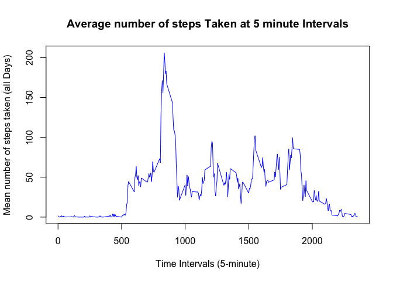
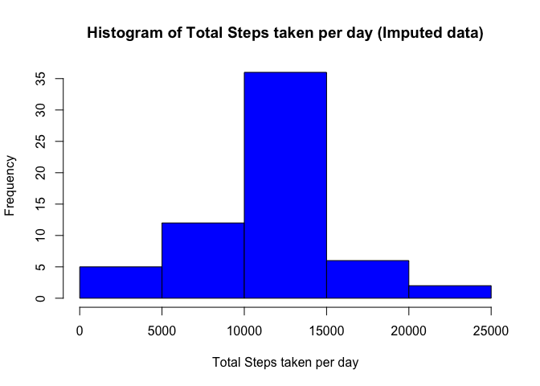
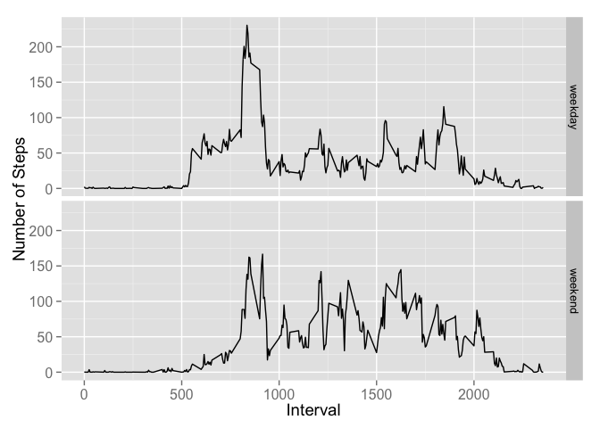

# Reproducible Research: Peer Assessment 1
M.Chitnis  
June 14, 2015  


## Loading and preprocessing the data  

```r
setwd('/Users/milindchitnis/Documents/My Docs/Data Analytics/RDir/RepData_PeerAssessment1') 
fitData = read.csv('activity.csv', sep=',', header= T)   
```

## What is mean total number of steps taken per day?  

```r
stepsDay <- aggregate(steps ~ date, data = fitData, sum , na.rm=TRUE )  
hist(stepsDay$steps, 
     main="Histogram of Total Steps taken per day",
     xlab="Total Steps taken per day",
     col="blue")  
```

 

## What is the average daily activity pattern?  
#### Mean , Median of original data

```r
meanSteps <- round(mean(stepsDay$steps),2)
medianSteps <- round(median(stepsDay$steps),2)
print(c("Mean steps for original data is " , meanSteps))
```

```
## [1] "Mean steps for original data is " "10766.19"
```

```r
print(c("Median steps for original data is " , medianSteps))
```

```
## [1] "Median steps for original data is "
## [2] "10765"
```

```r
stepsInterval <- aggregate(steps ~ interval, data = fitData, mean, na.rm = TRUE)  
plot(steps ~ interval, 
     data = stepsInterval, 
     type = "l", 
     xlab = "Time Intervals (5-minute)", 
     ylab = "Mean number of steps taken (all Days)", 
     main = "Average number of steps Taken at 5 minute Intervals",  
     col = "blue")  
```

 

## Imputing missing values  
#### Strategy for imputting missing values: Calculate the average for each interval and use that to complete missing values  

```r
maxStepInterval <- stepsInterval[which.max(stepsInterval$steps),"interval"]  
print(c("The max step interval is ",maxStepInterval))  
```

```
## [1] "The max step interval is " "835"
```

```r
missingVal <- sum(!complete.cases(fitData))
print(c("Total Missing values are ",missingVal))
```

```
## [1] "Total Missing values are " "2304"
```

```r
completeData <- fitData
for (i in 1:nrow(completeData)) {
  if (is.na(completeData$steps[i])) {
    value <- subset(stepsInterval, interval==completeData$interval[i])
    completeData$steps[i] <- round(value$steps,2)
  }
}

## Calculate the average for each day
completestepsDay <- aggregate(steps ~ date, data = completeData, sum , na.rm=TRUE )  
hist(completestepsDay$steps, 
    main="Histogram of Total Steps taken per day (Imputed data)",
    xlab="Total Steps taken per day",
    col="blue")
```

 

#### Mean, Median of Imputed data

```r
impmeanSteps <- round(mean(completestepsDay$steps),2)  
impmedianSteps <- round(median(completestepsDay$steps),2)  
print(c("Mean Steps for imputed data is " , impmeanSteps))  
```

```
## [1] "Mean Steps for imputed data is " "10766.18"
```

```r
print(c("Median Steps for imputed data is " , impmedianSteps))  
```

```
## [1] "Median Steps for imputed data is " "10766.13"
```

####  Analyis: Mean of original data and imputed data remains same as the mean of the interval is used to calculate imputed value.Median of imputted data has increased from that of the original median as the data set has more values.

## Are there differences in activity patterns between weekdays and weekends?  
#### Calculate averages for each interval on weekend and weekdays

```r
completeData$day <- ifelse(weekdays(as.Date(completeData$date)) %in% c("Saturday", "Sunday"), "weekend", "weekday")    
weekdayInterval <- aggregate(steps ~ interval, data = subset(completeData, day=="weekday"), mean, na.rm = TRUE)  
weekdayInterval$day <- "weekday"  
weekendInterval <- aggregate(steps ~ interval, data = subset(completeData, day=="weekend"), mean, na.rm = TRUE)  
weekendInterval$day <- "weekend"  

## Combine data for weekend and weekday for plotting  
finalData <- rbind(weekdayInterval, weekendInterval)  

## Plot the data using ggplot2
library(ggplot2)  
g <- ggplot (finalData, aes (interval, steps))  
g + geom_line() + facet_grid (day~.) + theme(axis.text = element_text(size = 12), 
                                             axis.title = element_text(size = 14)) + labs(y = "Number of Steps") + labs(x = "Interval")
```

 

#### Analyis: Average steps taken on weekdays has a spike in steps taken early in the day and then the number of steps taken reduces where as weekend has relatively consistent number of average steps taken throughout the middle part of the day. Overall, the avearge steps taken on weekend is  higher than the avergae steps taken on weekday which is expected as people tend to do more activities on weekends.
